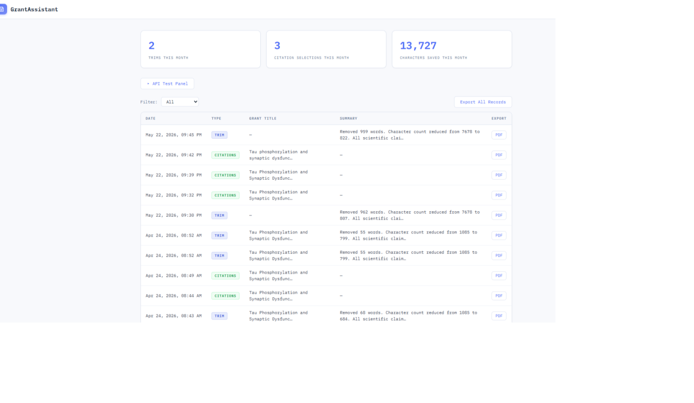
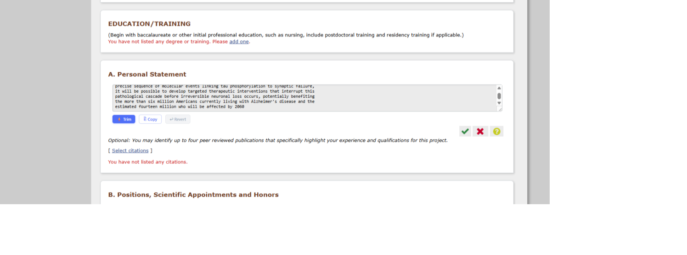
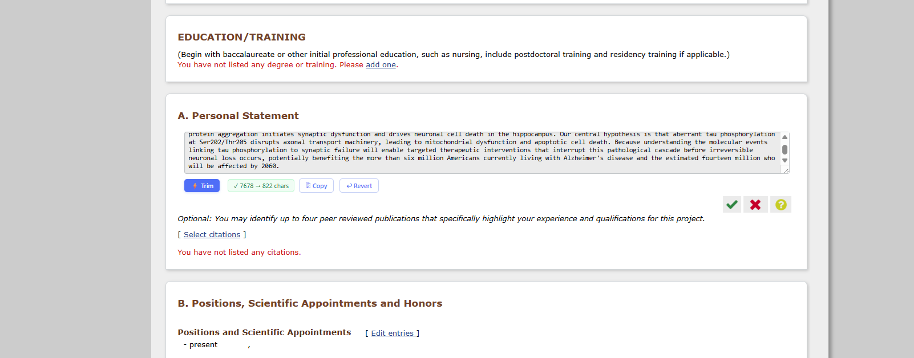
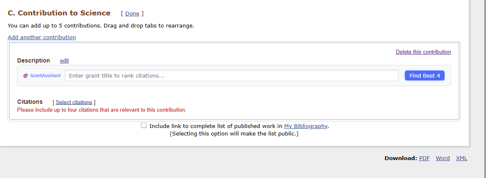
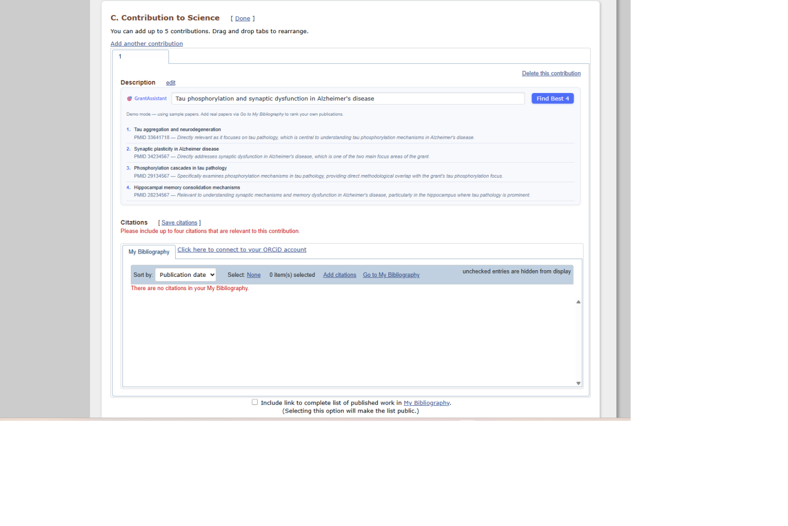

# GrantAssistant — SciENcv AI Copilot

> AI-powered text trimming and citation ranking for NIH SciENcv, with a built-in compliance audit trail for grant submissions.

**Live app:** [grant-assistant-omega.vercel.app](https://grant-assistant-omega.vercel.app)

---

## What It Does

NIH's SciENcv enforces tight character limits on biosketch fields and asks researchers to select their most relevant publications for each grant. GrantAssistant adds two superpowers directly inside SciENcv:

| Feature | What it does |
|---|---|
| **⚡ Trim** | Reduces a Personal Statement or Contribution description to fit the character limit — removing words without changing scientific claims |
| **🎯 Citation Ranker** | Given a grant title, ranks your My Bibliography papers and highlights the best four for that specific application |
| **📄 Audit Export** | Generates a signed PDF for every AI action, certifying that AI was used only for formatting/ranking — not for writing new science |

---

## Screenshots

### Audit Dashboard
Track every Trim and Citation action with one-click PDF export.



### ⚡ Text Trimming — Before & After
The Trim button appears below any editable textarea in SciENcv. After trimming, a success tooltip shows the character reduction and the Revert button activates.





### 🎯 Citation Ranker
The GrantAssistant panel appears in the Contribution to Science section. Enter a grant title and click **Find Best 4** to get ranked results with relevance reasons.





---

## Architecture Overview

```
┌─────────────────────────────────────┐
│  Chrome Extension (MV3, vanilla JS) │
│  content.js injects UI into SciENcv │
│  popup.js handles sign-in/sign-out  │
└──────────────┬──────────────────────┘
               │ Bearer token (JWT, 1 hr)
               ▼
┌─────────────────────────────────────┐
│  Next.js 14 App Router on Vercel    │
│  /api/trim       → Claude AI        │
│  /api/citations  → Claude AI        │
│  /api/audit      → Supabase         │
│  /api/audit/export → PDF via        │
│                    @react-pdf       │
│  /api/me         → Supabase profile │
└──────────────┬──────────────────────┘
               │ service-role client
               ▼
┌─────────────────────────────────────┐
│  Supabase (Postgres + Google OAuth) │
│  profiles table  (RLS enabled)      │
│  audit_records table (RLS enabled)  │
└─────────────────────────────────────┘
```

**Security model in one sentence:** The Anthropic API key never leaves the server. The extension stores only a short-lived Supabase session token. Every API route validates that token before doing anything.

---

## Local Development

### Prerequisites

- Node.js 18+
- A [Supabase](https://supabase.com) project
- An [Anthropic API key](https://console.anthropic.com)
- A Google Cloud OAuth 2.0 client (for sign-in)

### 1. Clone and install

```bash
git clone https://github.com/sidb5/grant-assistant.git
cd grant-assistant
npm install
cp .env.local.example .env.local
```

### 2. Configure Supabase

1. Create a new project at [supabase.com](https://supabase.com)
2. In the SQL Editor, run `supabase/schema.sql` to create all tables and RLS policies
3. Go to **Authentication → Providers → Google** and enable Google OAuth
   - You'll need a Google Cloud OAuth client ID and secret
4. In **Authentication → URL Configuration → Redirect URLs**, add:
   ```
   http://localhost:3000/api/auth/callback
   https://grant-assistant-omega.vercel.app/api/auth/callback
   ```

### 3. Fill in `.env.local`

```env
NEXT_PUBLIC_SUPABASE_URL=https://your-project.supabase.co
NEXT_PUBLIC_SUPABASE_ANON_KEY=eyJ...
SUPABASE_SERVICE_ROLE_KEY=eyJ...
ANTHROPIC_API_KEY=sk-ant-...
NEXT_PUBLIC_APP_URL=http://localhost:3000
```

### 4. Run the dev server

```bash
npm run dev
```

Open [http://localhost:3000](http://localhost:3000).

---

## Loading the Chrome Extension

1. Open `chrome://extensions`
2. Enable **Developer Mode** (toggle, top-right)
3. Click **Load unpacked** → select the `/extension` folder
4. The GrantAssistant icon appears in your toolbar

The extension is pre-configured to point at the production app (`https://grant-assistant-omega.vercel.app`). If you want to test against local dev, change `APP_URL` in `extension/background.js`, `extension/content.js`, and `extension/popup.js` to `http://localhost:3000` and reload the extension.

---

## Using the Extension on SciENcv

1. Navigate to [ncbi.nlm.nih.gov/myncbi](https://www.ncbi.nlm.nih.gov/myncbi/) and open your CV
2. Click the GrantAssistant icon → **Sign in with Google**
3. Complete Google OAuth in the new tab — the popup auto-updates when done

**Text trimming:**
- Click **Edit** on any biosketch field (e.g. Personal Statement)
- An **⚡ Trim** button appears below the textarea
- If the text exceeds the limit (2,500 chars for Personal Statement), Trim condenses it and enables **↩ Revert** so you can undo instantly

**Citation ranking:**
- Go to the **Citations** section of your biosketch
- The **🎯 GrantAssistant** panel appears above your bibliography
- Type your grant title and click **Find Best 4**
- The four most relevant papers are highlighted with a relevance reason

**Audit trail:**
- Every Trim and Citation action is logged to your dashboard at [grant-assistant-omega.vercel.app/dashboard](https://grant-assistant-omega.vercel.app/dashboard)
- Download individual or all-records PDFs as compliance documentation

---

## Deploying to Vercel

```bash
vercel deploy --prod
```

Set these environment variables in the Vercel dashboard (**Settings → Environment Variables**):

| Variable | Value |
|---|---|
| `NEXT_PUBLIC_SUPABASE_URL` | Your Supabase project URL |
| `NEXT_PUBLIC_SUPABASE_ANON_KEY` | Supabase anon key |
| `SUPABASE_SERVICE_ROLE_KEY` | Supabase service role key |
| `ANTHROPIC_API_KEY` | Your Anthropic API key |
| `NEXT_PUBLIC_APP_URL` | `https://grant-assistant-omega.vercel.app` |

---

## Project Structure

```
grant-assistant/
├── app/
│   ├── api/
│   │   ├── trim/route.ts          # POST — trims text to char limit via Claude
│   │   ├── citations/route.ts     # POST — ranks publications for a grant
│   │   ├── audit/route.ts         # GET — fetch audit records
│   │   ├── audit/export/route.tsx # GET — export audit records as PDF
│   │   ├── auth/callback/route.ts # GET — Supabase OAuth callback
│   │   └── me/route.ts            # GET — authenticated user profile
│   ├── auth/extension-login/      # OAuth landing page for the extension
│   ├── dashboard/                 # Audit trail dashboard UI
│   └── page.tsx                   # Landing page
├── components/
│   └── dashboard/
│       ├── AuditTable.tsx
│       └── TestPanel.tsx          # Dev-only API test panel
├── extension/
│   ├── manifest.json              # MV3 manifest
│   ├── background.js              # Service worker — token storage
│   ├── popup.html / popup.js      # Extension popup
│   ├── content.js                 # Injected into SciENcv pages
│   ├── auth-listener.js           # Captures token on extension-login page
│   └── content.css
├── lib/
│   ├── anthropic.ts               # Lazy Anthropic client factory
│   ├── supabase.ts                # Service role + token validation helpers
│   └── pubmed.ts                  # PubMed fetch utilities
├── supabase/
│   └── schema.sql                 # All tables + RLS policies
└── next.config.js                 # CORS headers for /api/* routes
```

---

## Auth Flow (Extension → Web App → Supabase)

```
1. User clicks "Sign In" in popup
2. Extension opens /auth/extension-login in a new tab
3. Page redirects → Google OAuth via Supabase
4. Google redirects → /api/auth/callback
5. Callback exchanges code, upserts profile, redirects to /auth/extension-login
6. Page posts: window.postMessage({ type: 'GRANT_ASSISTANT_AUTH', token })
7. auth-listener.js content script forwards token to background via chrome.runtime.sendMessage
8. Background stores token in chrome.storage.local with 1-hour expiry
9. popup.js polls storage every 500 ms and updates UI on token arrival
```

---

## Why the Audit Trail Matters

NIH's NOT-OD-23-149 guidance requires researchers to acknowledge AI use in grant applications. GrantAssistant creates a PDF record for every AI action that certifies:

- The scientific content, claims, and data were written by the researcher
- AI was used *only* to remove words (trim) or sort a list (citation ranking)
- No new scientific ideas were introduced by AI

This gives PIs a defensible paper trail without any extra work — it's generated automatically on every API call.

---

## Known Limitations

- **Institution not populated from Google OAuth.** Google's profile API doesn't include affiliation. The `institution` field in the PDF header will be blank until a profile-edit page is added.

- **SciENcv DOM selectors may drift.** The content script targets `textarea#previewAreaMarkdown` (Personal Statement) and `div.citationUIContainer.mybib` (My Bibliography). If NIH restructures those pages, selectors will need updating.

- **Citation ranker requires visible PMIDs.** The highlighter matches `PMID: XXXXXXXX` patterns in the rendered list. Papers without a visible PMID in the DOM won't be highlighted (though they're still returned in the ranked list panel).

- **PDF export uses Node.js runtime only.** The `@react-pdf/renderer` package requires the Node.js runtime. The export route cannot be moved to Edge Runtime.

---

## Tech Stack

| Layer | Choice |
|---|---|
| Framework | Next.js 14 (App Router) |
| Database + Auth | Supabase (Postgres + Google OAuth) |
| Styling | Tailwind CSS |
| AI Model | `claude-sonnet-4-20250514` |
| PDF Generation | `@react-pdf/renderer` |
| Extension | Chrome MV3, vanilla JS |
| Deployment | Vercel |

---

*Built for university researchers navigating NIH grant season.*
